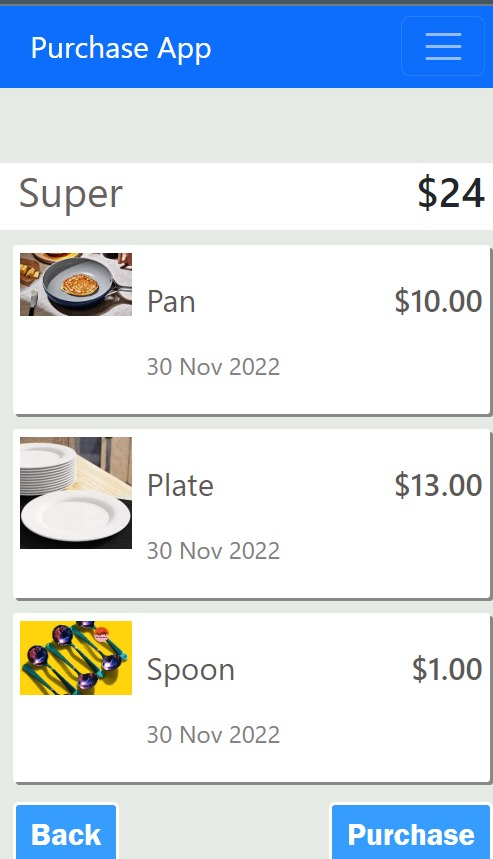

## Preview

# Naivsa Purchase App

>
An app where a user is able to select items based on a category and also be able to know the total cost of items selected

## Built With

- Ruby, javascript, css, sass
- Ruby on rails
- Devise
- Bootstrap

## Live Version
[Purchase-App](https://naivas-purchase.herokuapp.com)

## Video Presentation
[Live Presentation](https://www.loom.com/share/2259fd13609b4b27a958b1a384942a03)

## Getting Started

To get a local copy up and running follow these simple example steps.

### Prerequisites
- Laptop
- Text editor
- Knowledge of ruby, html, css, javascript and Bootstrap

### Setup
- Clone this project from git hub
- [Project](https://github.com/tingamapuro04/Purchase_App)
- Depending on the machine you use open the terminal and clone the project by running
- git clone https://github.com/tingamapuro04/Purchase_App
- Change the working directory to Purchase_App by running
- cd Purchase_App

### Install
- Once inside the Purchase_App directory install all the gems and other required resources
- Run bundle install
- Run rails server to see the app on your browser

## Authors

👤 **Alphonce Mobutu**

- GitHub: [@githubhandle](https://github.com/tingamapuro04)
- LinkedIn: [@adoyo_alphonce](https://www.linkedin.com/in/adoyo-alphonce/)

## 🤝 Contributing

Contributions, issues, and feature requests are welcome!

Feel free to check the [issues page](https://github.com/tingamapuro04/Purchase_App/issues/10).

## Show your support

Give a ⭐️ if you like this project!

## Acknowledgments

- Gregoire Vella on Behance.

## 📝 License

This project is [MIT](./MIT.md) licensed.

